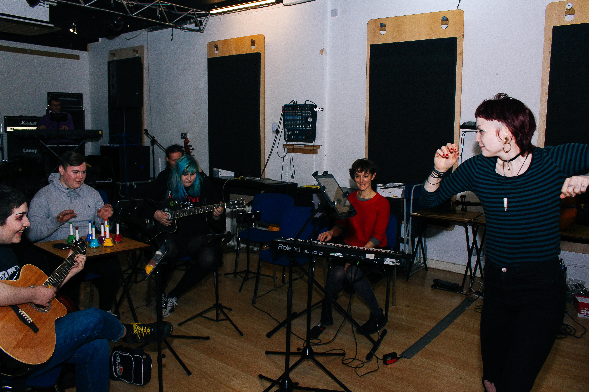
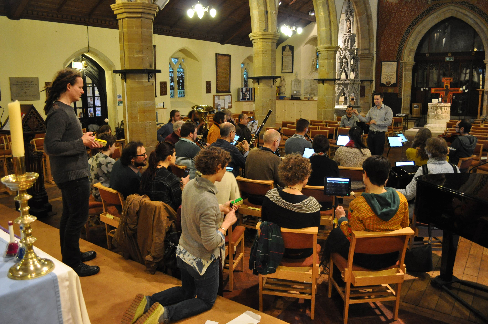
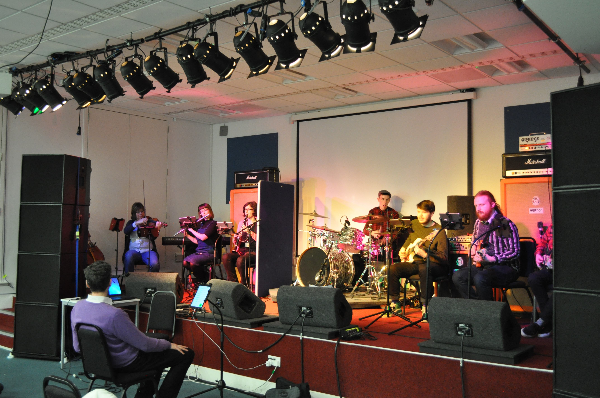

# NETWORKING TECHNOLOGY AND THE EXPERIENCE OF ENSEMBLE MUSIC-MAKING

_Access to Music Brighton._

When I volunteered to play piano in my daughter’s school orchestra I had no idea this would lead to an absorbing and rewarding, intensely collaborative, research project. During the early morning pre-class orchestra sessions, I noticed that some children became visibly upset or put off when they lost their place in the music. This made me think about beginner musicians and how they access (or don’t access) the experience of ensemble music-making. Reading music notation and playing in a group at the same time is a complicated activity, and often under-rated, because you are expected to learn it by diving in straight away. There is huge interest in ensemble music-making across the country. There are many digital solutions to support music-making and learning. But very little has been done in the area of supporting ensemble music-making. I decided to seek a solution.

My own expertise is in composing and conducting. Working with co-researchers with complementary arts, computing and psychology backgrounds, Dr Chris Kiefer, Dr Alice Eldridge and Dr Fidelma Hanrahan, we obtained a small grant for a pilot study under the AHRC Digital Transformations theme. Chris and Alice led the design and coding of a set of 16 iPads which we networked in order to display score and parts in basic animated form, thus helping the children to follow successfully. Fidelma designed questionnaires which enabled us to evaluate the children’s progress both normally and then with our iPads’ notation system added. We found that our system removed a lot of stress for the children, improved access to the experience (the orchestra grew) and enabled them to play longer and more complex pieces. The work was profiled on ITV Meridian which in turn stimulated a lot of encouraging feedback on social media from interested parents. Memorably, one boy commented on the ITV interview ‘it blew my mind because the sound is absolutely amazing compared to what it normally is!’

_CoMA Brighton._

One of the particularly exciting things was taking the basic pilot system from the core research, and trying it out in different settings. We collaborated with the Brighton Science Festival and the local Contemporary Music for All (Brighton) ensemble to produce an event in central Brighton which members of the public with little or no music experience could join amateur musicians to perform a new piece of contemporary music. The system, adapted so that one iPad displayed the part’s notes in colours which matched a set of special handbells, enabled a young girl of about six to successfully synchronise with an ensemble of advanced players. We also took the system to a workshop at a rock school (BIMM Institute Brighton) where we used it to bring together classical musicians and a rock band. And we took it to Access to Music Brighton where we were delighted to find that it would engage and interest young people with non-classical backgrounds in the value and creative potential of musical notation. 

				
_BIMM Institute Brighton._

Currently we are working with the Sussex Innovation Centre and the Sussex Humanities Lab,  thanks to a follow-on grant from the AHRC, to develop an identity for an app release of the basic system which we expect to happen in Autumn 2017.

This project was a chance to start a research team with great colleagues and to begin to develop truly collaborative and interdisciplinary work around musical notations in the humanities. I believe our team has very definite potential to develop further. Our feedback suggests consistently that users (ranging from primary school to professionals) think the basic system is very helpful; but that they would like a more seamless, musical and interactive experience which would be possible if we could find ways to get the tablets to ‘listen’ to the ensemble. 

Overall I am grateful for the opportunity to work on this. It was particularly rewarding bringing cutting edge research in music composition and computing to a social setting and to see the children immediately benefitting from the research.

Ed Hughes
Professor of Composition in Music
School of Media, Film and Music
University of Sussex.

**Links and Resources:**

For further information, including videos of an ITV local news report on the project and other video documentation, please see: http://netem.org.uk/media/

An initial report on the project is available via the proceedings of the _TENOR_ 2016 conference in Cambridge: http://tenor2016.tenor-conference.org/program.html

Eldridge, A, Kiefer, C, Hughes, E (2016) _Designing Dynamic Networked Scores to Enhance the Experience of Ensemble Music Making._ International Conference on Technologies for Music Notation (TENOR)

A final paper on the project’s findings has been completed and submitted for review to a peer reviewed journal and is currently under consideration.

