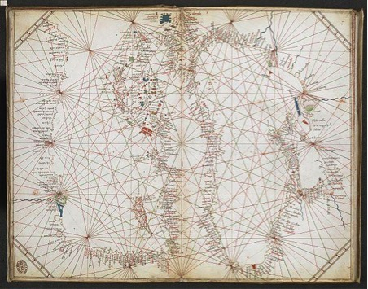
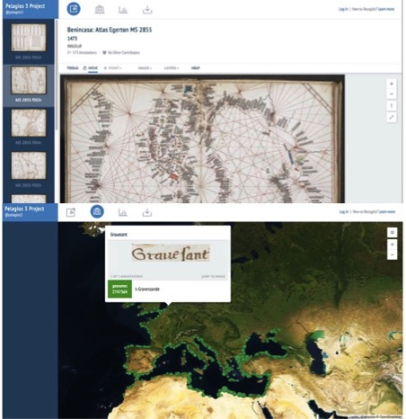
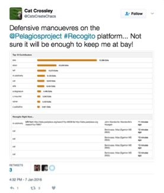

# PELAGIOS 4: A 21ST CENTURY KEY TO A 13TH CENTURY CODE

Can the digitised versions of different historical sources, such as voyage literature, route maps, seafarers’ charts and medieval pilgrimage texts be used to help researchers understand how pre-modern authors and mapmakers conceptualised their world? And can these sources be used in ways that tell us anything new about the world we live in today? 

These were two of the questions asked by Pelagios 4, an AHRC-funded project dedicated to building connections between different kinds of historical resources online. What the project found was more than a new perspective on the medieval world – it uncovered information hidden in maps dating back over six hundred years. 

Being able to link one document to another—and move easily between them—is one of the enabling features of the World Wide Web. More precisely, Pelagios’s semantic annotation methodology, by which means each place entity in Web documents (texts, maps or databases) is given a unique “uniform resource identifier” (from an authority gazetteer), allows the linking of related information through these shared references. In Pelagios 4, we helped a diverse range of scholars build and use these interconnected sources to help address key questions in the history of cartography. Our overall objective was to build connections between different sources but we were also able to contribute to the scholarship seeking to challenge a homogenized picture of the world – a picture reinforced by standardized global cartographic conventions which have become ubiquitous with the advent of digital Web mapping technologies. 

One of the less commonly known sources our scholarly partners used was the collection of mysterious portolan charts. Lacking indications of authorship or dates, portolan charts are maps based on observed directions and estimated distances as observed by pilots at sea.. They are also of critical importance for scholars due to the high volume of toponyms to be found in them. Land-based places, such as ports, harbours, headlands and other coastal locations, are commonly included, making them a valuable source for cross-referencing both place names and natural features with other texts and maps. Above all, they afford researchers a perspective of the world as seen from the sea, a sailor’s-eye view. (Image 1.) This view was key to answering one of the burning questions that these charts prompt—their symbology. The absence of a legend has meant these charts have been difficult to decode. To get a better understanding of the complex symbology that they use, it was necessary to develop an understanding of how medieval sailors viewed their world, and how they ensured that this knowledge was shared over the years. To address this issue requires bringing together different kinds of information and knowledge traditions. Enter Pelagios.

_Image1: Chart of the Black Sea and Eastern Mediterranean,
Grazioso Benincasa, 1473.  Image courtesy of the British Library_

The task of trying to decode these symbols fell to former British Library Map Librarian, Tony Campbell, and the former Hydrographer of the Royal Navy, Captain Mike Barritt. Aided by the digitization of the British Library's collection of portolan charts, and their annotation by Cat Crossley (more on whom in a moment), Tony and Mike focused on making sense of a particular kind of symbol, arranged in different configurations across the charts—dots and crosses in black and red. By using Pelagios’s linked data approach, Tony and Mike looked for shared place-name links between these charts and the other sources used in the Pelagios 4 project. What they found was that these dots and crosses conveyed critical information about the threats to mariners, threats such as rocks, reefs, river mouths, shoals and sandbanks. Decoding these symbols was made possible first by comparing the texts from the classical period, which also included references to offshore dangers; second, by overlaying the annotated portolan charts in a GIS (Geographic Information System) with contemporary satellite imagery, many of the symbols could still be evident to the naked eye (See Image 2).

_Image2: Screengrab of chart in Image 1, annotated in Recogito (top) with those annotations overlayed on to a contemporary satellite map (bottom)_

Tony and Mike thus showed that the portolan charts were highly accurate maps and were evidence for the cartographic sophistication of medieval mariners. But they also acted as more than simply maps: they were a type of cartographic aide-mémoire. In the words of Tony and Mike, “The charts' topological approach is reminiscent of the cartographic pragmatism displayed in the London Underground Map which tells us nothing of what lies above ground.” They served as visual summaries of the seafaring community's shared, ‘crowd-sourced’ knowledge. This was represented by means of a commonly understood symbology, which presented a comprehensive system of nautical warnings, conveyed by means of a visual code and which documented threatening and predictable offshore hazards in order to keep medieval sailors safe while at sea. 

These portolan charts, whose beauty still takes the breath away, are now online. Thanks to generosity of the Andrew W. Mellon Foundation, a significant selection of 392 maps from the British Library collection have been uploaded to Wikimedia Commons and added to the British Library’s data portal, data.bl.uk, where they are freely and openly available to all members of the public to study. Thanks too to the frenzied hard work of the BL’s Cat Crossley, who annotated the maps via Pelagios’s open Web annotation platform Recogito (http://recogito.pelagios.org/), many of them are also interconnected and have enriched metadata. Beware! Annotating with Recogito is dangerously addictive, particularly when you can see how your performance compares to others. (See Image 3 which depicts Cat’s enthusiasm for topping the league table of annotations.)

_Image3: annotating can be addictive!_

In working with scholars and researchers, Pelagios facilitated the use of a variety of sources to ask specific questions about how people in the past saw the world in which they lived and worked. It also reflected the importance of engaging more directly with the GLAM (gallery, library, archive and museum) community, whose collections are critical to good humanities research. However, it also served as a reminder that Linked Data (like any other DH technique) is only ever a tool for research – and while it cannot answer questions, it can be extremely powerful as a clue for finding those answers. 

Elton Barker

**Links and Resources:**

Campbell, T. and Barritt, M. ‘The representation of navigational hazards: the development of toponymy and symbology on portolan charts from the 13th century onwards’ in Linking Places, Placing Links: Classification, Representation and the Epistemology of Geohistory, E. Barker and L. Isakson (eds). Indiana University Press, forthcoming. 
