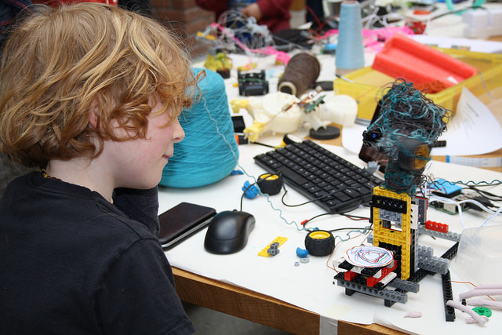
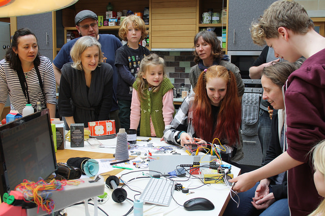
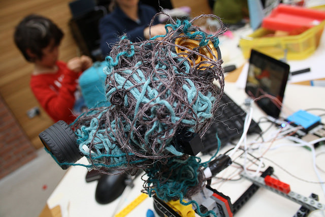

# TANGLEBOTS

Tangling threads is straightforward for a human and their hands, but a real challenge for a robot. For the finale to the AHRC *Weaving Codes - Coding Weaves* (http://kairotic.org) project we tried a new approach to creative technology education inspired by this, teaching families about code, robotics and thread through the process of building “Tanglebots” (http://fo.am/tanglebots/).

The first Tanglebots workshop came near the end of the *Weaving Codes - Coding Weaves* project, conducted by Alex McLean, Ellen Harlizius-Klück, Dave Griffiths and Emma Cocker. The aim of our overall project was to re-link modern digital tools and the ancient and fundamentally *digital* art of weaving. We looked for the theoretical points where weaving and computer programming connect and developed codes and code machines to pursue these questions. Tanglebots engaged a group of families in pursuing these questions with us.

The concept for the Tanglebots workshop was to combine abstract computer programming with physical objects, concentrating on sensor input and movement as output. When first talking about possible workshops with children, we’d discussed the possibility of making a functional loom in a couple of hours with only broken toys and LEGO. We decided that this workshop would be interesting, but was destined to fail and would end up in a mess of tangled threads and broken technologies. Alex suggested turning these difficulties to an advantage, and making tangles the actual goal of the workshop. In the same spirit we created a series of prizes for ‘alternative’ categories such as “Most technical effort with least impressive result”. By focusing on error, we planned to create a fun and supportive environment where conceptual insights and engagement with material were privileged over slick end results.

The weaving focus allows us to ground the workshop in loom technology, and demonstrate the challenges of manipulating thread, with its history of technological development over millennia. FoAM Kernow (https://fo.am/), as research collaborators and host for the event, have a Harris loom resident in their studio, and for this first workshop, Ellen started us off with an introduction to the fundamentals of weaving.

The workshop format we used was heavily influenced by Paul Granjon’s *wrekshops* (http://www.zprod.org/zwp/wrekshop/) – wherever possible we reused technology by pulling apart e-waste, making use of electronics, motors, gears and ideas from the surprising complexity of what’s inside the things people throw away. This turned out to have a powerful implicit message about recycling. Parents Dave talked to had tried taking things apart to learn about them, but the next step – making use of the parts discovered (as we were doing here) needs a little more help to do.

FoAM always recognises the importance of food in communal events, in providing both sustenance and inspiration for the goings on. In this case lunch was tangled by Amber Griffiths and Francesca Sargent, forming cardamom knots, spiralised courgette and spaghetti fritters.

We have thought about different approaches to future Tanglebots workshops, perhaps starting them with a manual tangling exercise (such as weaving with rope) in order to focus on the threads before getting distracted by the technology. Likewise, LEGO has a strange all or nothing effect, once you start using it – everything has to work that way. It would be interesting to try a workshop without, and seeing what different creative options emerge.

It was important to incorporate the *Weaving Codes* research process, so deliberately setting goals we don’t yet know the answers to. From our perspective this gave us an opportunity to open up our ideas, and look for new directions and research questions to guide our future work. The result of this was a successful proposal to the European Research Council, and so we are now embarking on a new five year project *PENELOPE: A study of weaving as technical mode of existence* (Grant agreement no. 682711). This project will explore the connections between weaving and digital technology or art, especially in ancient times where weaving has been a paradigm of order for poetry, the state and even the cosmos. Included in that project is a method of building digital devices that allows us to understand better how ancient weavers might have thought while entangling the threads on their looms, which were quite different from our present-day handlooms. The project will be conducted at the Research Institute for the History of Technology and Science at Deutsches Museum, Munich.

Alex Maclean

**Links and Resources:**
All our resources for the tanglebot workshop are uploaded to our github repository (https://github.com/Kairotic/tanglebots/) to help you run a tanglebots workshop if you wish!

**Research team:**
Alex McLean (School of Music, University of Leeds); Ellen Harlizius-Klück (Centre for Textile Research, University of Copenhagen); Dave Griffiths (FoAM Kernow); Emma Cocker (School of Art & Design, Nottingham Trent University).

As well as being supported by AHRC Digital Transformations, this project was part of British Science Week, supported by the British Science Association.
