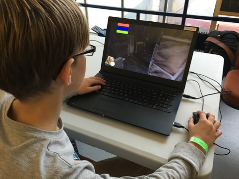
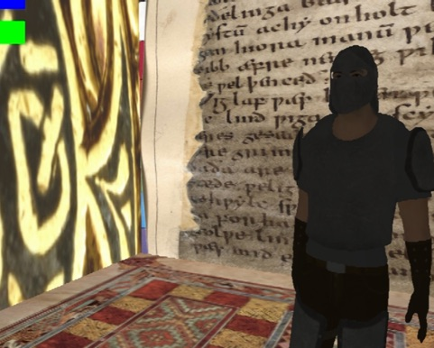

# PLAYING BEOWULF

Beowulf remains a popular text in school and university English courses, with opportunities for work at different levels. It can be a robust fantasy adventure, a complex and sophisticated heroic narrative, an exemplar of alliterative Anglo-Saxon poetry, a treasure trove of Old English language. Its history is equally fascinating: its mysterious journey from oral performance to written manuscript; its precious status as a unique version; its near-destruction in the 1731 fire in the Cotton library; its value as one of the great treasures of the British Library. These physical changes are accompanied by a myriad of textual transformations and adaptations in theatre, film, animation and videogame.

Our project aimed to explore the nature and value of these transformations. We worked with digital curator Stella Wisdom at the British Library, and five different user groups, each with its own focus and set of interests. A common asset used by all the groups was a game-authoring software tool developed by the project. Two of the groups are briefly described below.

**Game City Workshop**

This workshop was organised in collaboration with Game City, an annual celebration of games at the National Videogame Arcade in Nottingham. One young participant, 11-year-old Aaron, made a game in which the player, as Beowulf, is given the mission to find the dragon by the voice of Hrothgar, the king, moving on to encounter an armed warrior standing in his way, and then finding and killing the dragon. Aaron had worked on visual programming software before so he quickly picked up the rule-making system of Missionmaker to program the events in his game. He only had two hours to make it, so it’s quite brief – but he had ambitious ideas about how to extend it. He suggested adding the dragon’s mother (Grendel has a mother in the poem), and also suggested showing the death of Beowulf at the end and offering a second player the chance to play as another character, Wiglaf, and try to gain the crown.

**UCL Anglo-Saxon**

Led by Anglo-Saxon specialists Richard North, Vicky Symons and Simon Thomson, a group of UCL students explored how making videogames of Beowulf might enhance their study of the poem. One example is a ‘manuscript game’ made by student Calum Cockburn which explores the Beowulf manuscript’s context. It serves as a prologue to two levels made by fellow students, in which the player can choose to play as Beowulf or as Grendel. This transforms museum and library artefacts into a 3D playable environment, leading up to the players’ two choices. It is a good example of the principle of co-curation envisaged by the wider project – a principle in which archival treasures such as the four codices Calum represents in his game are unlocked from their institutional context and made available for manipulation, inquiry and transformation. Calum achieved this through his role as a scholarly game-maker, and by envisaging the potential players.

**What We Found**

In terms of the relation between game culture and Beowulf, our initial hunches that this was a good fit seemed to be borne out. The various games demonstrated repeatedly that the Beowulf narrative makes the perfect three-level horror game, with end-of-level boss monsters of increasing power. The segue from Beowulf to videogame is by no means arbitrary, but is bound up in the progression from Tolkien’s mediaevalist fantasy, especially in *The Lord of the Rings*, to the development of table-top *Dungeons and Dragons* games, to digital roleplaying games. More broadly, this history of textual transformations is situated in the growth of popularity in mediaeval-styled fantasy fiction, film and television, the latest and most spectacular example at the time of writing being *Game of Thrones*. The potency of these genres, and the abiding fascination they provoke in audiences, was evident in many of our participants, not only young people but also university students of English and their tutors.

Finally, the combination of literature and computer science through game design produced some suggestive ideas for cross-curricular work in schools and universities. To code Beowulf offers possibilities for both subject areas to reimagine themselves. What does it mean for computer science to be creating algorithms for narrative, for literary arts, for videogame aesthetics? What does it mean for the literature classroom to think of a prestigious literary text as formula, mechanics, numerical entities, Boolean operators, computational design? These are questions which can help us out of the age-old arts-science divide famously observed by CP Snow in 1959 (Snow 1959). It’s time we found some more convincing answers. By exploring the history of Beowulf, Tolkien, mediaevalist fantasy and videogames through the lenses of English, Media and Drama, and computer science, we can begin to bridge this divide in and for a digital age.

Andrew Burn
Professor of English, Media and Drama
UCL Institute of Education

**Links and Resources:**
Snow, Charles Percy (2001) [1959]. *The Two Cultures*. London: Cambridge University Press

Tolkien, JRR (2015) (Edited by Tolkien, C.) *Beowulf: A Translation and Commentary*. New York: Mariner Books.

A full account of the project, with video captures of the games, can be seen on the Playing Beowulf site at: <https://darecollaborative.net/2015/03/11/playing-beowulf-gaming-the-library/>
