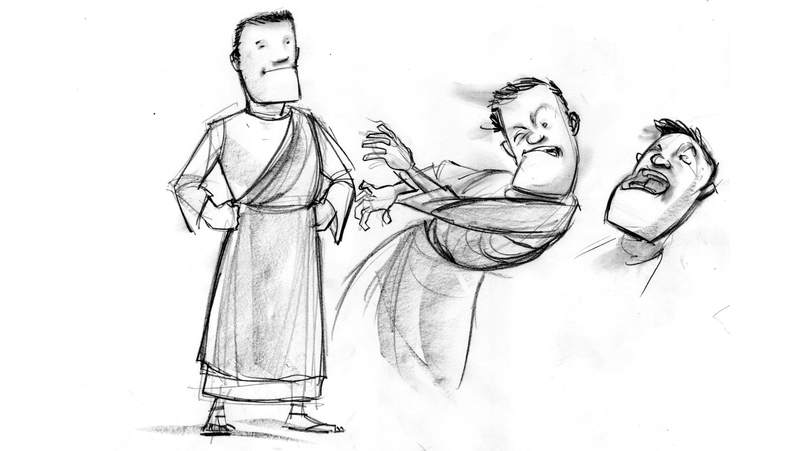
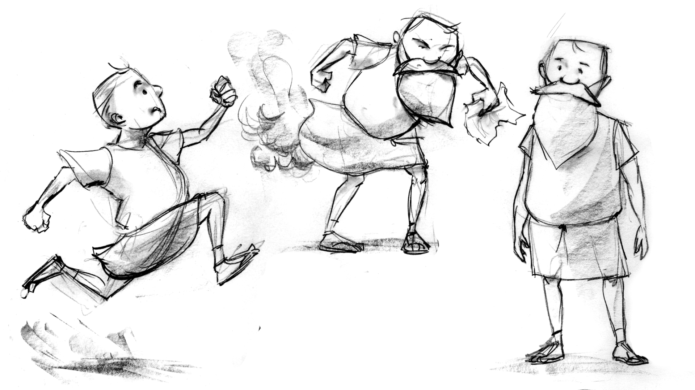
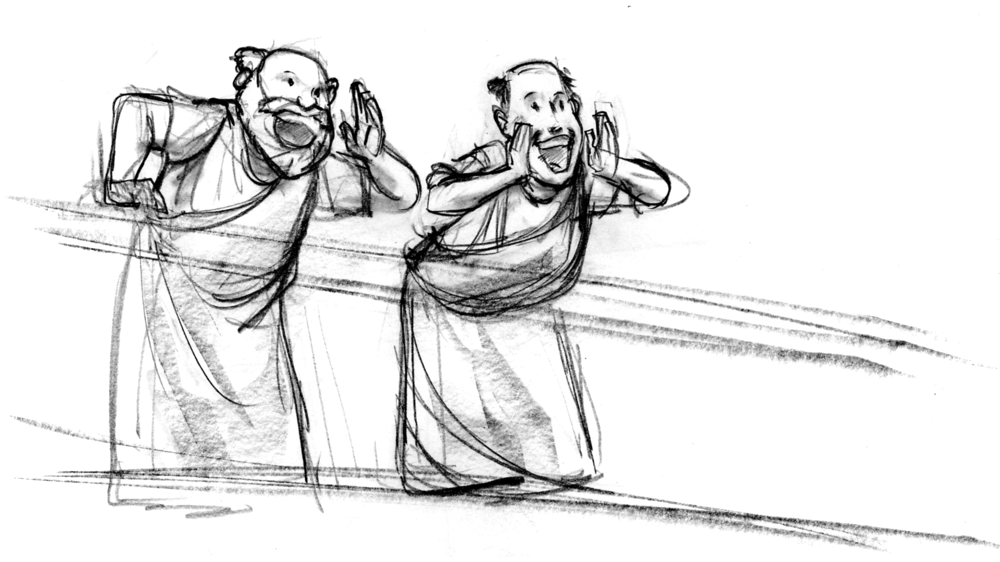

# BROKEN SCENES: RESURRECTING ANCIENT FRAGMENTED VOICES THROUGH ANIMATION

Classicists and papyrologists are part of a long-standing initiative to integrate the discipline into the digital sphere through websites and applications based on visual and textual data, an initiative that goes back to the 1990s. The goal has been to produce tools that have impact on the research of professional scholars and students. The field of papyrology has been quite successful in this respect. However, creative and artistic output aimed at communities beyond academia – public engagement, outreach, or whatever we call it – is lacking in the evolving Digital Humanities. And so, when we came across a unique AHRC funding challenge to produce creative content, we proposed *Broken Scenes*. Can the artistry of animation be integrated with papyrology to visualize and help resurrect lost ancient performative voices preserved only in fragmented papyri? That was the question.

In 2014 the *Oxyrhynchus Papyri* published P. Oxy. 5189, a 6th century CE Greek Mime. A popular form of entertainment in antiquity, the Mime was a type of sketch comedy performed on stage or in the street and known for its vulgar humour and improvisation. Despite such popularity, the textual evidence of ‘low’ literature and entertainment of the Graeco-Roman world did not make it into the familiar channels of the mediaeval transmission, a process in which selected authors were copied by scribes and scholars. Our knowledge of popular entertainment is thus largely dependent on papyri. Reconstruction of this fragmentary evidence, however, is a challenge due to the literal holes and gaps in the text, which we supplement as best we can, according to our knowledge of the Greek language and literature. In this case, there is only a narrative description of the movements and actions of the characters, including the actors’ lines, with the following discernible content: 1) clothing (perhaps cross-dressing); 2) eating and (badly) cooking; and 3) beating and slapping, perhaps triggered by bad cooking. Due to its fragmented state, the text is very difficult to read. But this was never a text to be read – it was meant to be acted. Accordingly, the idea of animation as a visual, rather then purely textual, means of reconstruction emerged.

In collaboration with Acme Filmworks, Oxford papyrology suddenly found itself on Motor Ave in Los Angeles, California, just a few blocks away from Sony Pictures. In producing *Trashy Humour: A Comedy in Pieces*, the process was not unlike other period pieces in production in Los Angeles or London. Before a character was drawn or a script written, we provided the necessary detail: the historical background to the Mime and its performers, images of clothing based on ancient mosaics and sculpture, and even funerary portraits that reveal actual faces from Graeco-Roman Egypt. As papyrologists, we wanted to preserve the integrity of the ancient performance and its comedy. But as the initial storyboards and script were drafted, we realised that supplementing the gaps in the papyrus was the ideal moment for collaborative creation with more than just Greek philology. In creating a coherent story from a fragment, we added comic elements and material, such as hecklers, audience members shocked at the use of foul language, and even a goat bent on eating the script – because goats are funny. For the modern audience, the idea was to stitch everything together with familiar comic elements to provide an easy transition into the ancient and broken world of the papyrus. *Trashy Humour*, in 5.49 minutes, depicts a Mime troupe performing on the streets of Oxyrhynchus during a festival and the horse races. Over the course of their performance, the bad cooking and all the slapping, they are plagued by one problem: due to a series of incidents, their script gradually becomes a fragment. To add a bit of metacomedy, our problem becomes theirs.

Creating this short film resulted in many unexpected opportunities. During the grant period we represented the project at the 2015 Annecy International Animated Film Festival, where we produced articles about our trip for the digital media site Animation World Network. And while working with Acme in Los Angeles, I was even invited to attend a live table read of an upcoming episode of *The Simpsons* with the entire cast. But, more importantly, we created something for everyone. *Trashy Humour*, as a product of the animation industry, will be submitted for awards at film festivals. As a product of classics and papyrology, it can be used in the classroom to teach ancient popular culture and the Mime. 

J. H. Brusuelas

**Links and Resources:** 
For more information and screenings go to: www.papyrology.ox.ac.uk/trashyhumour
