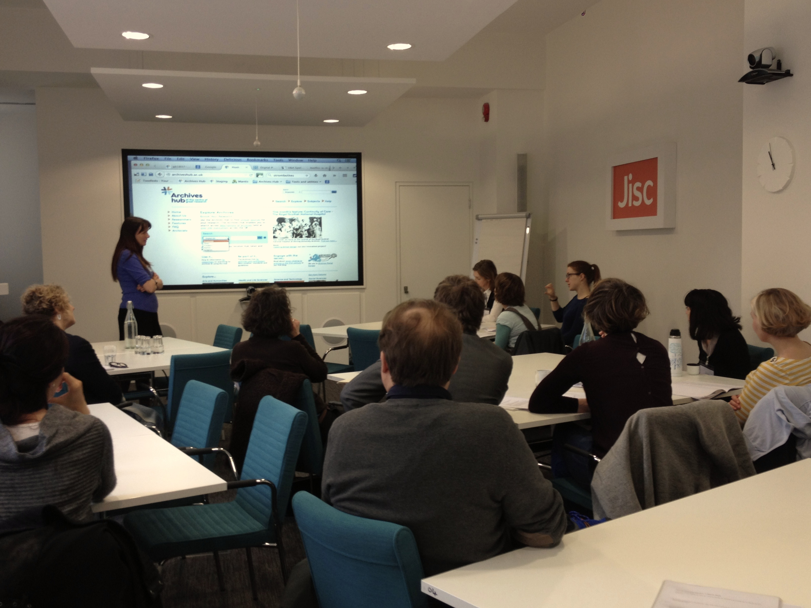
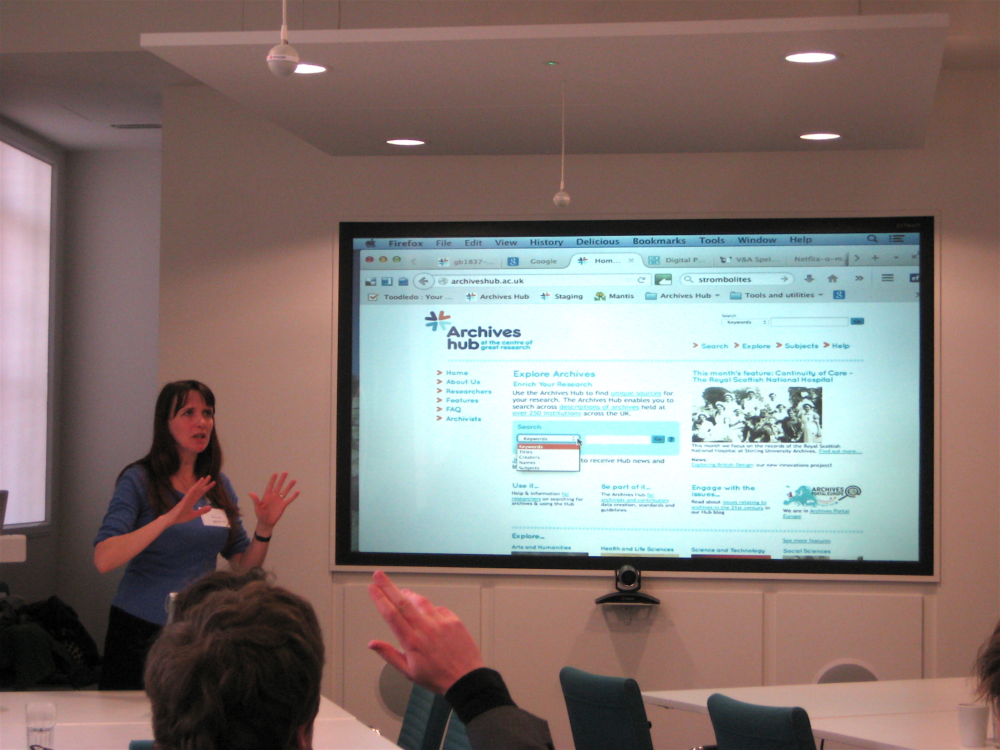

# EXPLORING BRITISH DESIGN

>History is not static but dynamic. No generation is privileged to grasp a work of art from all sides; each actively living generation discovers new aspects of it. But these new aspects will not be discovered unless the historian shows in his field the courage and energy which artists have displayed in their use of methods in their own epoch.[1](#fn1)

Sigfried Giedion began his landmark book of 1941, Space Time & Architecture: the Growth of a New Tradition with a consideration of the approach and method of the historian. It was precisely the kind of energy he describes that drove the project Exploring British Design. What would happen, we wanted to know, if we deployed in new ways the data we had built over the years to describe the holdings of the Design Archives? Conversations between academics and information professionals that connect research and practice are often inspiring and provoking. Throughout our relationship with the team at Jisc’s Archive Hub, we had often tackled immediate technical issues relating to the delivery of our archival descriptions online and, at the same time, speculated on the possibilities of the data we had, and the capacity of the structures and systems that might rearrange and represent it in new ways. What might this reveal and what could this show us? How would we recognize its omissions and inadequacies?

_Co-investigator Jane Steveson of the Archives Hub debates archival research processes with students, June 2015._

To answer these questions Exploring British Design was developed as a proof of concept, cross-sector web portal to conjoin data, expertise and audiences. Its purpose was to connect and amplify information about Britain’s rich design history held in numerous museums and archives.  Through the building of detailed biographical authority records as entry points, linked together by the relationships between people, organisations and events, the project brought into view the possibilities of building narratives of numerous kinds across collections and across institutions. By linking archival content through biographical authority files that provide rich context through both relationships and chronologies, the project created entirely new routes by which to discover design archives. It revealed the dispersed, nationwide footprint of Britain’s design heritage, and how information about a particular designer, or manufacturer, or event, might rest in a wide variety of archives. Moreover, the imperative of this project, to show connection and to loosen institutional boundaries, established a challenge to the conventional ‘top down’ presentation of online archive systems.

Discussions with students and researchers that took place as part of the Exploring British Design project have informed the re-design of the main interface of the Archives Hub which was launched in November 2016. The prototype itself is accessible from both the Archives Hub and Design Archives web pages. It would be exciting to see the effect of this model if it were to be employed more widely, and if it were to connect to further archives held in different repositories, especially internationally. Yet this would demand a shift that institutions seem resistant too.[2](#fn2) Commercial imperatives, rather than research imperatives, all too often mean that online visitors to collection records are more frequently directed to the respective online shop than to associated resources elsewhere.

_One of the early data visualisations showing, from the archival data, entities connected to businessman and designer Alastair Morton (1910-1963)._

Yet from some quarters this shift is gradually happening, although more in theory than practice at the moment. Recently the archive community has been developing  the ‘Records in Contexts Conceptual Model’ that aims to move from inward-looking hierarchical descriptions to ‘a model that makes it possible to describe records and the environments in which they are created, accumulated, used, and managed in a way that more fully captures and expresses the complex contextual realities than can be done using a single hierarchical description.’ For more information, see: www.ica.org/sites/default/files/RiC-CM-0.1.pdf.

The Exploring British Design project has run in parallel to this major project, clearly reflecting the increasing understanding of the importance of context and connection. Undoubtedly, university archives have an important role in undertaking theoretically informed research of this kind. In connecting disparate, and relatively small yet invaluable archives and collection they help represent histories that are inevitably more representative. The criticality-informed production of data structures, driven by educational imperatives rather than the commercial priorities of institutional digital strategies, has an important role in leading work of this kind.

Catherine Moriarty

**Links and Resources:**
Sigfried Giedion (1945) _Space, Time and Architecture: The Growth of a New Tradition_. Cambridge: Harvard University Press.

Anna Kisby (2016) ‘Creating Exploring British Design: a prototype website exploring linked data, an entity-based approach and collection enhancement’ in _ARC Magazine_, pp. 7-9.
http://www.archives.org.uk/images/ARC_Magazine/ARC_Mag_May16.pdf

Catherine Moriarty (2016) _Monographs, Archives, and Networks: Representing Designer Relationships Design Issues_, Vol. 32:4, pp. 52-63.
http://www.mitpressjournals.org/doi/abs/10.1162/DESI_a_00416#.WKWD4mNhlTc

Project website: www.exploredesign.archiveshub.ac.uk

**Research Team:**
Exploring British Design AHRC Grant Ref: AH/M002438/1 comprised the University of Brighton, Jisc, and the Design Museum as partners, and the research team: Principal Investigator, Catherine Moriarty (University of Brighton); Co-Investigator, Jane Stevenson (Jisc); Data Developer, Pete Johnson (Jisc); Data Editor, Anna Kisby, (University of Brighton); Web designer, Tom Hart.

<ol>
<li id="fn1">Giedion, 1949: 5.<a href="#fnref1">↩</a>
</li>
<li id="fn2">This topic was debated at the British Museum event <i>Museum of the Future: Changing Public Dialogues with Museum Collections in the Digital Age</i>, held on 16 October 2014. <a href="#fnref2">↩</a>
</li>
</ol>
