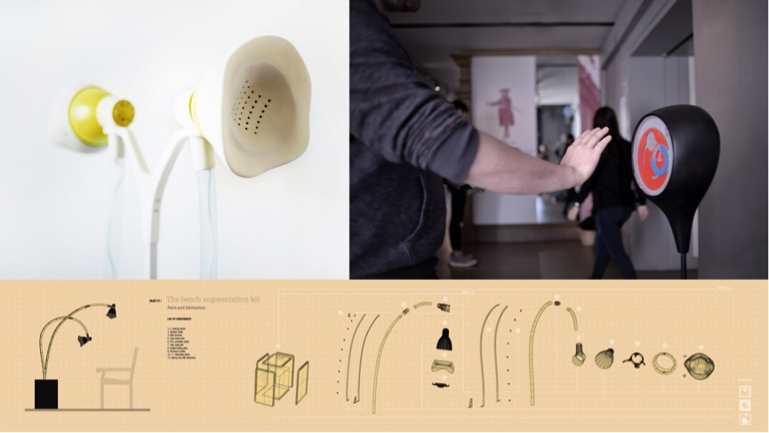

# SOUND AND VISION SCAPES (SVIS)

The Sound and Vision Scapes (SViS) research project offers insight into novel concepts and forms of experiencing cultural heritage through the use of locative media and Internet of Things (IoT) technologies. The campus of the University of Greenwich is a location with a rich history, both fictional and factual – fictional as it stood in as location for a large number of movie productions, and factual as location of historic events of interest. SViS employed Internet of Things technologies to provide access and to novel user experiences to engage with the history of the site. As part of the project we designed a series of speculative interactive augmentation devices that were employed to mediate visitor experiences on the world heritage site. We also explored the use of different sensors (e.g. proximity sensors) for contextual awareness and the triggering of micro-location storytelling.

Augmented, speculative on-site objects (such as a modified park bench) that evoke curiosity and wonder are used to provide cues for user interactions and provide entry points for informal learning. The park bench, for example, is augmented with a futuristic looking storytelling device that, fitted with bespoke electronics, enables people to immerse themselves in sounds and stories of the past. These devices, apart from playing the memories back, also invite visitors to record memories and to collect and share social interpretations.  One could argue that traditional methods of presenting data on history and culture, usually implemented in museums, are not always best placed for widening participation. The research through design approach of SViS investigated and proposes novel ways to use the built environment to encourage serendipitous discovery, participation and everyday learning.

_Speculative Storytelling Devices_

Interactive on-site objects are typically composed of two separate layers, one which plays the story and the other one which allows the potential visitor to record his/her personal memory related to the site e.g. via voice recording or text messages. To provide a scaffold and as entry points for engagement with the local history different media such as locative audio narratives were created. This approach can be scaled up through the use of geo-located user-generated and broadcasting content. Our project applied rapid prototyping and digital fabrication methods (e.g. 3D print, laser cutting) in combination with physical computing devices to deliver novel user experiences for familiarising site visitors, local communities and students with the culture of the historical location of the Royal Naval College.

Ralph Barthel

**Links and Resources:**
Project Website: http://svis.uk

**Project Team:**
Aleksandra Cicha and Ralph Barthel (University of Greenwich, Department of Computing & Information Systems); Andrew Hudson-Smith (UCL Centre For Advanced Spatial Analysis)
