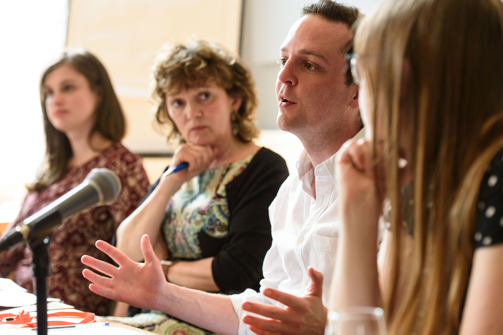
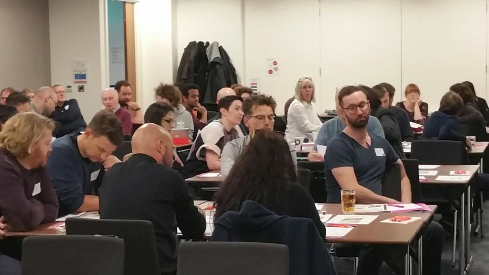
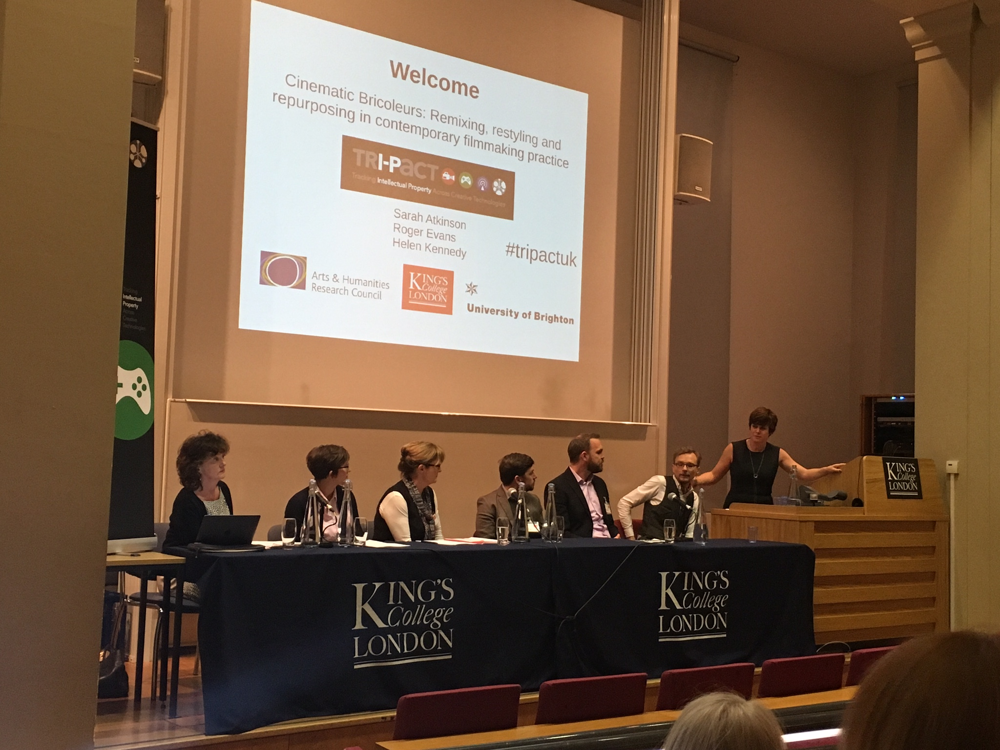
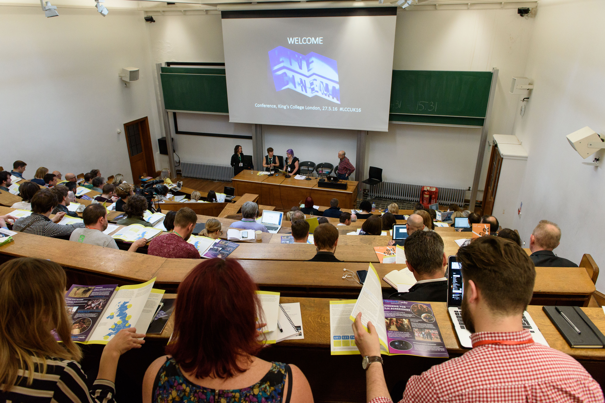

# TRI-PACT: TRACKING INTELLECTUAL PROPERTY ACROSS THE CREATIVE TECHNOLOGIES

Set against the backdrop of a dynamic landscape of digitally transforming and increasingly convergent creative industries, this one-year project stimulated creative and strategic dialogue around the management, protection, sharing, access, use and reuse of Intellectual Property (IP) through the delivery of four participatory events.

These events brought together creative practitioners, media professionals, independent artists and freelancers from the technology-rich creative territories of Film, Broadcast and Games, along with members of the public and academics from a range of disciplines in order to collaboratively address the issues pertaining to intellectual property both within and across these domains.

The first - _To IP or not IP?_ consisted of a series of workshops delivered in conjunction with Develop - the International Games Developer Conference held in Brighton in July, 2015. The workshops were targeted at independent games producers, developers and games companies and included a panel of experts from diverse organisations such as The Association for UK Interactive Entertainment (UKIE), Channel 4, and Ignition Films, each offering their top tips for indie game developers to maintain, enhance and protect their intellectual property.  The sessions offered guidance to those looking to adapt an existing IP for use in new games formats and for those looking to transfer their game IP to another format or medium.

The second – “Stories of Our Shared World – Exploring value in co-creation.” was delivered as part of the _Transmedia for Change_ conference in London in October, 2015.

The third - _Cinematic Bricoleurs: Remixing, restyling and repurposing in contemporary filmmaking practice_ held in January 2016, at King’s College London explored key critical and creative contributions to the field of remixing, restyling and repurposing existing audiovisual material in contemporary filmmaking practice.  Speakers at the event presented and considered these works alongside established film industry practices through the lens of intellectual property. Contributors included Graham Rawle creator of The Guardian’s _Lost Consonants_ and author of internationally acclaimed _Woman's World_, Professor Francesca Coppa - founding member of the Organization for Transformative Works, and Desiree D'Alessandro, an independent remix artist. A panel which included Julia Reda, MEP and President of the Young Pirates of Europe and Elizabeth Gibson, a BBC intellectual property lawyer, debated the opportunities, challenges and futures of audiovisual content reuse in the conflicting contexts of territory-specific IP legislation and the wider global digital economy.

The final event was the Live Cinema Intellectual Property (IP) & Licensing Master class which was hosted at _The Live Cinema Conference_, King’s College London in May 2016.  Representatives from across the film industry, the film exhibition sector, arts and cultural institutions, funding bodies and the academy attended the conference. Speakers and participants came from organisations including the BFI, comScore, Event Cinema Association, National Theatre Live, Luna Cinema, The Royal Albert Hall, Glyndebourne, Sing-a-long-a Productions Worldwide, Sheffield Doc Fest, Rooftop Film Club, Sneaky Experience, Prince Charles Cinema, Curzon Cinemas, Picturehouse Entertainment, Vue Entertainment, Backyard Cinema, Edinburgh Film Festival, Creative Skillset, the Royal Opera House, The Southbank Centre, BBFC, National Media Museum, Disney, The British Museum, Pearl & Dean Cinema, Arts Council England, and Filmbank Media.

The Master Class was a direct intervention implementing the findings of the TRI-PACT Live Cinema case study that also continued the collaboration with TRI-PACT’s Intellectual Property Adviser, Prof. Charlotte Waelde (Professor of IP, Coventry University) who chaired the session featuring Dr Barbara Lauriat (Dickson Poon School of Law, King’s College London), Matt Parritt (Harbottle & Lewis LLP) and Bryony Forde (Icon Film Distribution) as panelists.

The creation and delivery of Live Cinema experiences pose specific IP challenges to producers, creatives, and distributors since they can include reinterpretations of the original text (such as soundtrack re-scoring) and the use of existing Intellectual Property (such as costumes, props and characters) in immersive cinema performances. The master class brought together IP experts and lawyers specializing in media rights with representatives from the Live Cinema industry involved in the commissioning and delivery of new and innovative live cinema experiences.  They debated whether changes in law, changes to the current policies, changes in the working practices and new education and training initiatives were needed to address IP issues faced by this emergent sector. Contractual issues, actors and performance rights, trademarking, character licensing and merchandising, celebrity endorsement were all discussed.

All four events were developmental and transformational, inspiring new conversations and nurturing new collaborations. The sequence of events and the continuity of participants supported the elaboration and evolution of these discussions and created new knowledge and stimulated new ideas to take forwards and share in all their diverse professional domains.

Sarah Atkinson

**Links to resources produced by the project:**

The Live Cinema Conference Digital Resource Pack Link:
http://estore.kcl.ac.uk/product-catalogue/academic-faculties/faculty-of-arts-humanities/department-of-culture-media-creative-industries/live-cinema-conference-digital-resources-pack

The Live Cinema Network Link:
http://www.livecinemanetwork.org

**Project Team:**
Dr Sarah Atkinson, King’s College London – PI
Dr Roger Evans, University of Brighton – Co-I
Helen W. Kennedy, University of Brighton – Co-I
