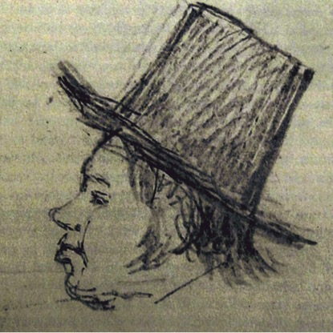
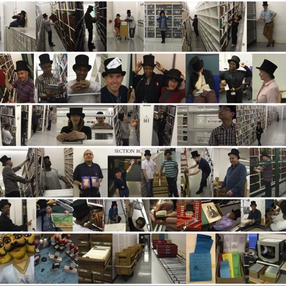
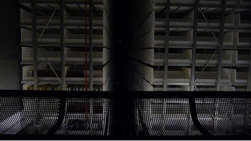

# INTERNET OF CULTURAL THINGS

The Internet of Cultural Things
What role can cultural institutions play in fostering a more creative and critical understanding of the cultural dimensions of datafication? In earlier projects (Our Data Ourselves, AH/L007770/1, http://www.big-social-data.net) we similarly examined the cultural dimensions of datafication at the level of mobile ecosystems. Partnering with teen coders in Young Rewired State we developed tools and applications for the creation of a big social data commons, seeking to cultivate a more open and democratic relationship with the data we generate. The Internet of Cultural Things (https://internetofculturalthings.com/) project was an effort to scale-up those efforts to the level of our lived environment, increasingly comprised of interconnected devices, systems, services and people. The idea was to foreground an august cultural institution to refocus public awareness of data flows in order to make more visible these tangible realities. 

We proposed that an arts and humanities engagement with cultural heritage in the age of data could act as a counterpoint to the managerial drive for efficiencies that dominates discourse around the ‘Internet of Things’. Specifically, we would examine the born-digital infrastructure of the British Library in collaboration with a practice-based digital artist, making this data visible in both a temporary site-specific installations and interventions for public engagement. Through experimental artistic practice we were able to dig into this cultural data generated in situ and illuminate and transform the way both people and cultural institutions interact.

Our practice-based research was led by the visual artist Richard Wright (http://www.futurenatural.net/) who has a scholarly background in the aesthetics of digital film and a wide body of work in digital animation and art. Wright became ensconced as an artist-in-residence in the British Library, a move that gave our project a more intimate understanding of data infrastructures. This unintentionally forged a genealogical path to the ubiquitous rendering of everyday life into discrete and interconnected data, one resonant with a conceptual approach previously developed by our co-investigator Jussi Parikka (2012). It is Dublin Core metadata, developed a few decades ago by pioneering librarians and internet-based information managers, that enabled the full digitisation of resource discovery tools for the collection management of both born-digital and analogue or physical objects. As for libraries and cultural institutions, so for the Internet of Things stack, where the Dublin Core remains integral to the application level, in the discovery, access and management of things.

Wright dug much deeper into the data infrastructure of the British Library, to the historical figure of Thomas Watts, the 19th century keeper of books initially tasked in 1838 with moving the entire library collection from the original Montagu House to the British Museum. 

Watts faced a rather contemporary crisis: managing the discovery and access of a rapidly growing collection. By the 1850s, the explosion of books meant the collection could no longer be kept on permanent display. Watts developed the ‘elastic system’ of shelfmarking and storage, an uncannily modern response enabling flexible data searches. The once open shelves were replaced by a modern system of ‘data retrieval’: that is, one where the data (books) were stored separately from its place of processing (reading).

Wright’s site specific installation was The Elastic System (http://www.elasticsystem.net/), a 'database portrait' Watts. Beyond mere digital portraiture, however, it was also a cultural data interface, providing users to actually access items from the British Library, and to think anew about how we store and access massive quantities of information. Wright constructed a 2500 megapixel generative mosaic by photographing the spines of 4,300 books which are in subterranean storage at the St. Pancras library, an area restricted from public access. Each digital spine was then connected live to the library’s electronic requesting system, allowing The Elastic System to function as a catalogue. To clarify, it is zoomable to the scale of individual book spines and fully interactive. The Elastic System went live in September 2016, enabling users to visually browse and access part of the British Library’s collections, a cultural practice that had not been possible since Watts’ time in the mid-19th century. 

There is another layer, however, to The Elastic System. When a user clicks on a book, it is removed from the digital ‘shelf’ revealing a second image underneath. What then becomes visible is the work that goes on in the library’s underground storage basements, the hidden part of the modern requesting system. When enough books are requested, British Library staff are revealed, labouring underground, and tipping the hat (a facsimile of the one favoured by Watts). 

One might speculate, at that point, on how different the image might be, were there to be an iteration of The Elastic System for, say, an Amazon warehouse. The highly proprietary data infrastructure, non-public nature, and robotic rule of those massive human-nonhuman sites of discovery-access and retrieval of consumer goods, however, mean that image is likely to remain largely hidden from public view. 

We did, however, gain some sense of the wider national logistics of management of the cultural institution in our field visit to the British Library’s main storage facilities in the Yorkshire town of Boston Spa. Here we one can see the state-of-the-art nonhuman system of robotic data retrieval, moving at speed both horizontally and vertically through stacks 20 meters high.

Upon closing at the British Library, The Elastic System toured, going on display at the University of Southampton Hartley Library in December 2016-January 2017
(https://level4gallery.wordpress.com/2016/12/19/elastic-system-at-hartley-library/
https://www.southampton.ac.uk/amt/news/events/2017/01/the-elastic-system-a-talk-on-cultural-data.page). It was also presented at the 2016 Liverpool Biennal at FACT Liverpool for the Episodic Data of Culture panel, where the research team with curator Hannah Redler discussed the project in relation to new ideas and artistic practices in the context of cultural institutions (http://www.biennial.com/events/episodic-data-of-culture). 

The Elastic System is a creative iteration of a larger and longer-term project, developing the ‘techno-cultural method’ (Coté and Pybus, 2017) which deploys workshops and other creative modes of technological engagement to open up the materiality of computational media and data flows for a better understanding of its cultural and social dimensions. This is an inclusive, ongoing and exciting path for humanities researchers.

Mark Coté

**Research team:** 
Mark Coté, PI (King’s College London)
Jussi Parikka, CI (University of Southampton); Richard Wright.

**Links and Resources:**
https://internetofculturalthings.com/

Project blog:
https://internetofculturalthings.com/blog/
http://blogs.bl.uk/living-knowledge/2016/11/the-elastic-system-what-can-you-do-with-a-library.html
Elastic System:
(http://www.elasticsystem.net/)

**References:**
Coté, M. And Pybus, J. (2016) Simondon on Datafication: A Technocultural Method. Data Culture & Society, volume 2, issue 2. DOI 10.14361/dcs-2016-0206
Parikka, J. (2012) What Is Media Archaeology, London: Polity Press. 

