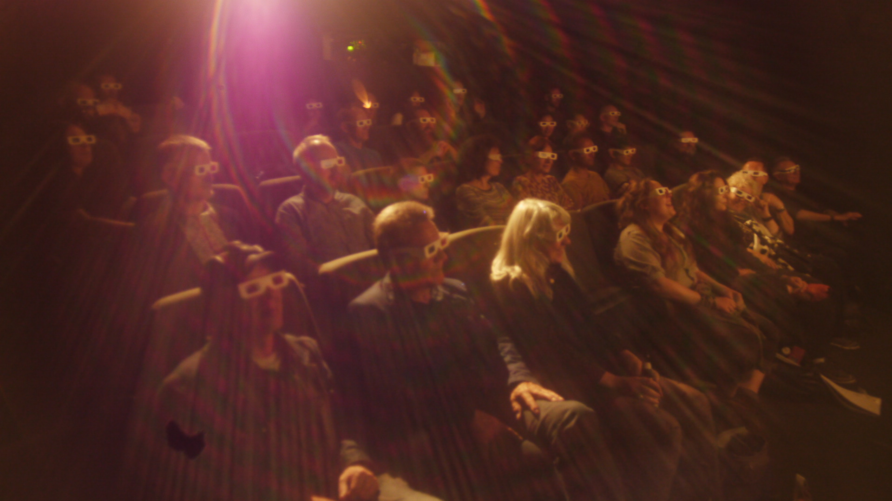

# THE AUDIOVISUAL ESSAY: A DIGITAL METHODOLOGY FOR FILM AND MEDIA STUDIES

Scholars researching film and media traditionally publish their work in the same forms as other disciplines in the humanities - notably, books and critical essays. But the democratization of video production technology provides exciting new possibilities for conducting analysis and conveying arguments about moving images by using moving images. _The Audiovisual Essay_ teamed up academics and video-makers to explore different ways in which written film and media research can be transformed, adapted, and developed into video-based ‘audiovisual essays’.

The project took as its starting point the edited volume _Indefinite Visions_ (eds. Beugnet, M., Cameron, A., Fetveit, A., 2017. Edinburgh University Press). Contributors to the book were invited to a two-day public symposium at the Whitechapel Gallery, London in June 2016, where they presented their research and engaged in dialogue with film-makers and moving image artists. A group of contributors then teamed up with film- and video-makers on a series of audiovisual essays that together explored diverse approaches to the theme of ‘indefinite vision’. The resulting nine videos focused on phenomena including blur, flicker, glitch, blackness, slow motion, and night vision.

The project tested a range of collaborative models through which academics without previous experience of video production could explore the video essay’s creative and critical potential, and use it as a means of communicating with large non-academic audiences. These included:

+ ‘Hands-on’ collaboration between an academic and video-maker, in which a work was jointly authored by both
+	‘Hands off’ collaboration between an academic and video-maker, in which the two engaged in creative dialogue but the video-maker took overall creative control of the final work
+ Indirect engagement in a video essay by an academic, for example through the use of their writing as a source text for the video, or through their contribution of a voice-over track for use in it.

The resulting videos, in turn, will provide the broader film and media studies community with a range of methodological models for how to conduct audiovisual film and media criticism, by demonstrating a range of uses of key creative tools including montage, split-screen, voice-over, and various forms of image manipulation.

Other events that emerged from the project included two nights of screenings of experimental and essayistic videos at Close Up Film Centre, London; a workshop in which video essayists were able to discuss the present and future of the form; and a masterclass at the British Film Institute with video essayist and film-maker Kogonada – the first ever public event at the BFI dedicated to the video essay. The video essays that formed the project’s core research outputs premiered at Alchemy Film and Moving Image Festival in March 2017.   

Richard Misek

**Links and Resources:**
Documentation of the Indefinite Visions symposium is available at: www.indefinitevisions.com.

The video essays that emerged from the project will be available on this site and in a special double issue of _InTransition: journal of videographic film and moving image studies_ in June 2017
