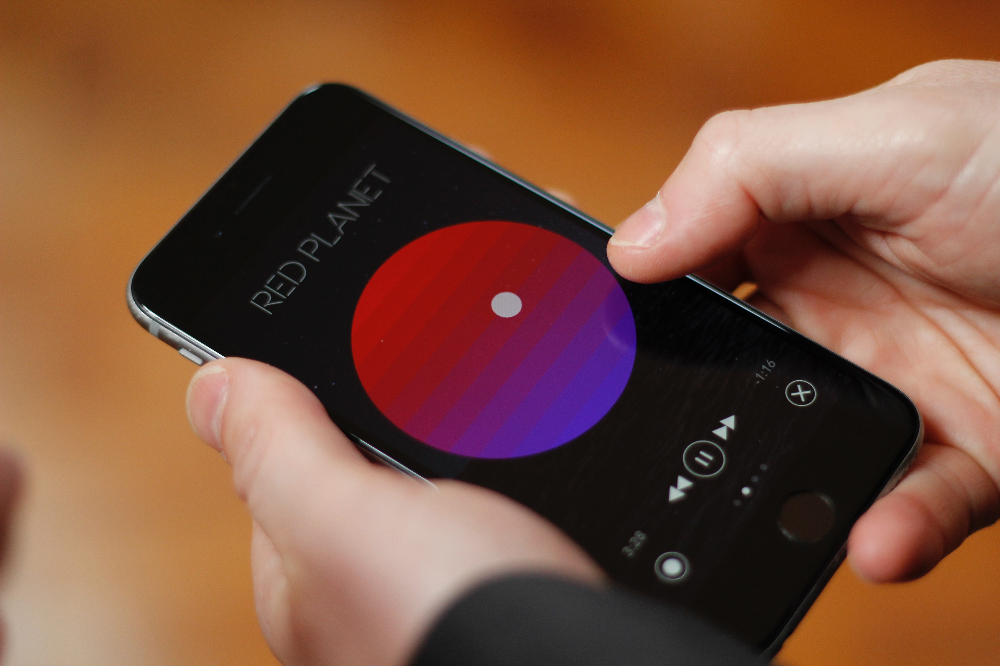
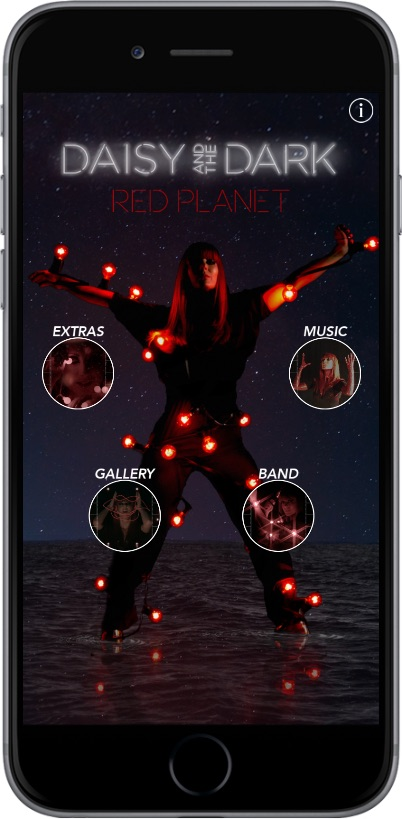
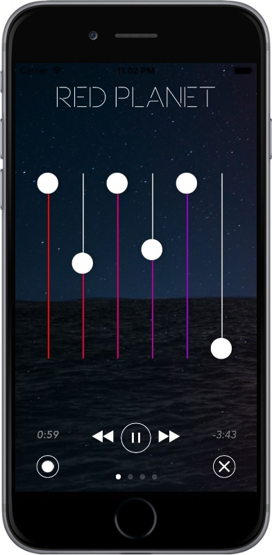

# TRANSFORMING DIGITAL MUSIC: INVESTIGATING INTERACTIVE PLAYBACK

The Transforming Digital Music project gave a unique opportunity to explore the connection between music artist and fan or listener through an enhanced interactive digital playback platform. The research project embedded the creative process firmly within the technology realm, and equally saw examples of the new digital platform inspiring and transforming the artistic approach to song writing and music making. A fundamental success of the project was the powerful connectivity between technology developer and creative artist, pushing and pulling the development process and generating a final design that could not have been realised with an autonomous creative or technical approach.

The developed interactive playback platform allows the music artist to share a much broader creative vision with their audience, which was explored in an attempt to bring a more intimate and emotive connection for their fanbase, whilst generating an innovative new commercial model for marketing recorded music to consumers. The platform allows visual, narrative and social media to be incorporated within a digital album package, but, more importantly, it enables the fan or listener to manipulate the playback in ways that have never before been possible as a consumer of recorded music. The developed ‘interactive album app’ allowed the listener to decide on and manipulate the genre of the song being played in a smooth and creative manner. For example, a song consisting of standard pop-rock instrumentation (drums, guitar, synth, strings and vocals) can be manipulated to render in real-time as an electronic dubstep version, or an acapella group version, or a folk-acoustic version, or a blend of styles. Equally the listener can manipulate instrument stems, removing the vocals, or isolating the drums, or deducing their own preferred mix of the recording.

We learnt that the artist in our project, Daisy and The Dark, felt more connected to their fan base by allowing listeners to ‘get inside the music’ and explore a wider creative world that the artist wanted to share, in comparison to conventional digital download and music streaming platforms. We learnt that the technology also inspired the artist to explore new creative outputs and music production techniques. A fascinating finding of the research was the level of creative empowerment that the artist received from the ongoing design of the interactive playback platform. The artist was challenged to provide three different versions of each song for the album app, but instead was inspired to explore their creative process deeply, and ultimately returned with five versions per song. For one song, _Circus_, the artist delivered a pop version, acoustic version, electronic dance, industrial rock and jazz-folk versions, which all represent authentic aspects of Daisy and The Dark’s musical persona. The artist would have never been inspired to generate such vast and varied creative content had it not been for the innovative platform that was developed within this research, so the process yielded a new opportunity and method for music artists to express their creative breadth and depth in ways that have previously been impossible to share or commercialise. The investigators also learnt specific music production methodologies to facilitate populating the music platform, which has brought valuable knowledge for music producers who are developing content for interactive, film, virtual reality and game related applications.

The app was downloaded and used by over 1000 individuals and, through user feedback and focus group discussions, we learnt about consumer perception towards interactive commercial music platforms. Users were intrigued by the interactive content and were seen to engage for approximately 50% longer in real time with the interactive album than with a similar non-interactive version. The research was aimed at developing a new music platform that would encourage music listening to become an active, foreground activity, rather than a background or passive artform that is only experienced in accompaniment of some other activity. The data gathered from within the app itself confirms that this was indeed achieved, whilst also yielding deep knowledge and data about user listening trends and habits. The interactive music app is a disruptive proposition that brings with it a new commercial model, and so has the potential to rejuvenate the revenues of recorded music sales in the future. The project learnings therefore describe a true ‘digital transformation’ that can bring new creative and commercial benefits to the global music industry.

Rob Toulson & Justin Patterson

**Links and Resources:**
Download the free Daisy and _The Dark Red Planet_ EP in the Apple App store here: http://bit.ly/RedPlanetApp

**Research Team:**
Professor Rob Toulson, Principal Investigator (University of Westminster); Prof Justin Paterson (University of West London).
