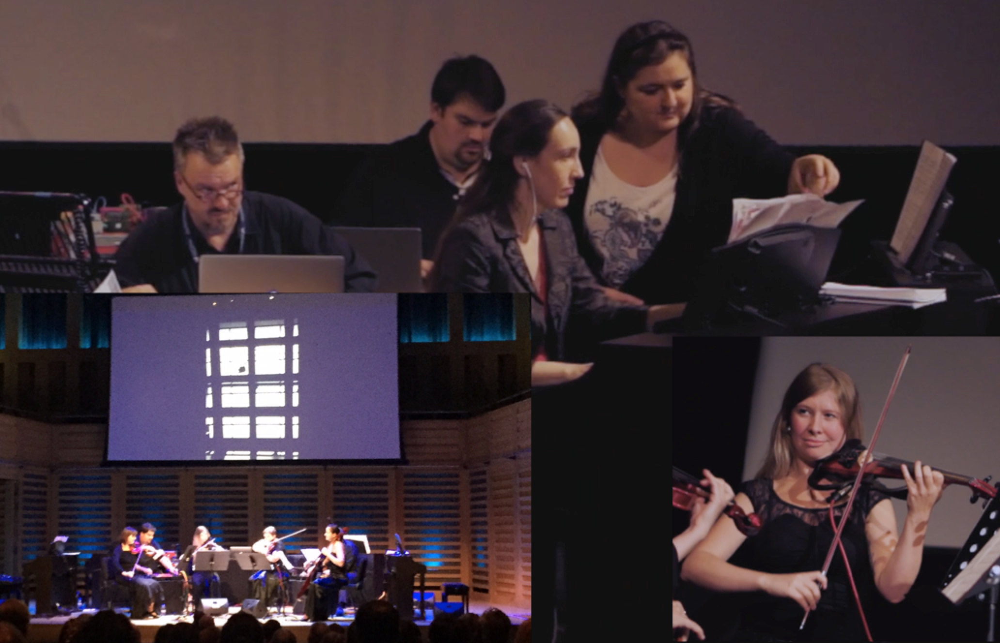

# CLASSICAL MUSIC HYPER-PRODUCTION:  A PRACTICE-AS-RESEARCH PROJECT

Like a theatre production exploring new meanings in a Shakespeare play by staging it in a contemporary setting, our project used both studio recording and live surround sound reinforcement technologies to reinterpret a range of pieces from the classical repertoire through production techniques taken from contemporary popular music. Between April and November 2015 we conducted a series of practice-as-research experiments using repertoire for voices, strings and piano by composers from as far back as Palestrina through Haydn, Mozart, Chopin, Schubert, Franck, Ravel, Debussy, Shostakovich and a contemporary piece written by Richard Beaudoin of Harvard University for cellist Neil Heyde from the Royal Academy of Music. More details about the various experiments can be found at http://www.uwl.ac.uk/classical-music-hyper-production including a few of the videos that were produced during and after the project.

The major impact events of the Hyper-Production Project were a series of public surround sound concerts in Ealing, Birmingham and culminating with a concert at London’s King’s Place (see photo) on October 7th 2015. Using a six speaker surround sound system, the concert involved video projection, audio playback and live performances on four Roland digital electronic keyboards by Dr. Capulet and three students from the London College of Music, electric string instruments by the Konvalia Quartet and digital and analogue signal processing and dub mixing by Dr. Bourbon and Dr. Zagorski-Thomas.

The first piece was a Haydn piano sonata in C major which was written for the pianist Therese Jansen when Haydn was in London in 1794 and combined his playful humour with some virtuosic writing to show off the potential of the new technologies of the recently developed Broadwood piano mechanism. Building on Haydn’s idea of crafting sections that used sometimes dramatic and sometimes comical contrasts between the different sonic possibilities of his new instrument, we used digital sampling technology to take the piece through a range of different piano sounds including plucked, scraped and hammered strings, a toy piano, a giant three metre tall upright, banging and tapping on the wooden case and its final self-destruction.

This was followed by Ravel’s _Pavane pour une infante défunte_ which involved re-arranging this piece for solo piano for four pianos and voice. Separating the piano lines into four parts allowed us to cross fade the different lines into different speaker in the array and get the music to swirl around the audience. The repeating melody line was sung by Agata Kubiak and this was drenched in reverberation to create a ghostly voice from the past. Next was Chopin’s _Ballade No. 2 in F major, op. 38_ which was also re-arranged for four digital pianos to allow the spatial effects and delays which were added to the mix to encircle the audience. During the delicate and elegant dance sections, as the piece moves further away from the original key the sounds became more distorted and discordant. In the dramatic stormy sections the rapid piano runs were squeezed and twisted as they chased around the concert hall. The first half finished with the 4th movement of Franck’s Violin Sonata in A major. In this piece the piano and violin keep swapping lines in a complex contrapuntal arrangement. The hyper-production version exaggerated this theme by cross fading between digital piano and electric violin versions of all the different lines.

The second half started with three Debussy _Preludes_ from _Book 1 Nos. 10-12 (La Cathédrale Engloutie, La Danse De Puck & Minstrels)_ which took the impressionistic narratives from each of these pieces (re-arranged for four pianos again) and used dub mixing techniques to explore the evocative and atmospheric mood of the first piece and the playful quirkiness of the other two. The concert closed with Shostakovich’s _String Quartet No. 8 in C minor, op. 110_ with each of the electric instruments played by the Konvalia Quartet going through a battery of electric guitar effects pedals performed by Dr. Bourbon and Dr. Zagorski-Thomas. This live electronic processing of the piece with distortion, wah wah, phase, flange, delay and reverb took this sombre, tragic and menacing piece into new and disturbing sound worlds and epitomised the research aims of the project: to use technology to explore new interpretations of classic pieces.

Simon Zagorski-Thomas

**Project Team:**
Dr. Simon Zagorski-Thomas, Principal Investigator (London College of Music, University of West London); Dr. Amy Blier-Carruthers (Royal Academy of Music); Dr. Andrew Bourbon (London College of Music, University of West London); Dr. Emilie Capulet (London College of Music, University of West London)
