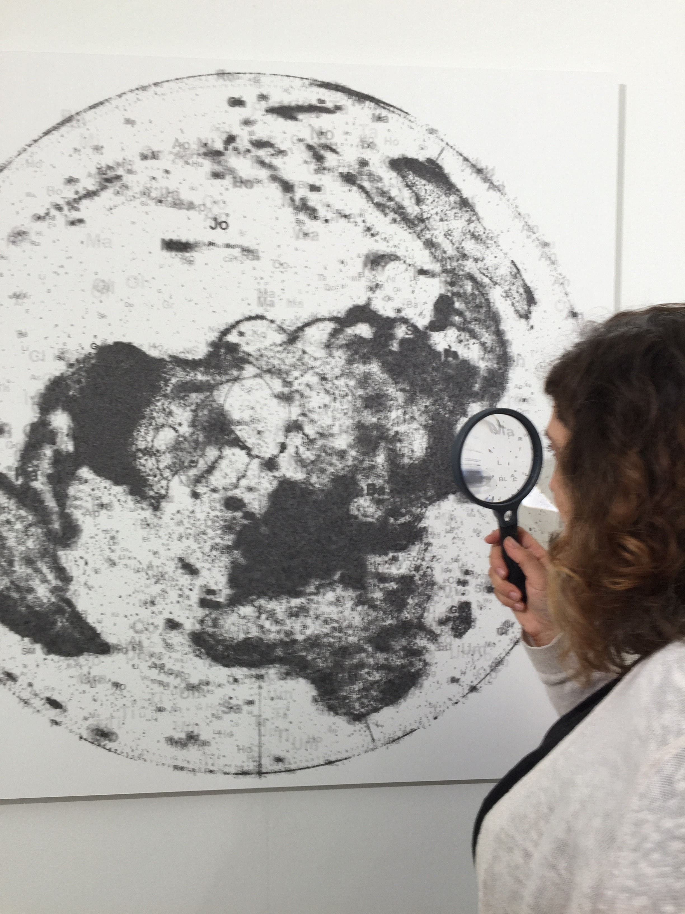

# DIGITAL REALISM: VISUALISING THE SOCIAL THROUGH DIGITAL ART PRACTICE

_CODEX Europe (2014), installation animating Wikipedia language edits from a 12-year period._

In an era when public issues of concern are increasingly framed, mirrored and played out as exchanges and circulations of data (e.g. via Twitter and Facebook), we are told that big data technologies promise fundamental changes in our ability to represent and understand human behavior. Our practice-based research project set out to explore the cultural implications of this by asking how digital artists might use social media data to reflect upon social, political and technological change by producing speculative geographies derived from social media posts and geo-data. Artworks produced during research were internationally exhibited at: Geo-Codes: Mapping a Practice in the Post-Print Age exhibition, the China Academy of Art, Hangzou: '25' London Gallery West, London; Athens Digital Arts Festival, Greece and at the International Symposium of Electronic Arts (ISEA), Dubai.

Several artworks with the collective name _CODEX_ including large-scale digital data animations (Image 1) and prints on paper (Image 2) ere produced by geographically mapping Wikipedia’s language edition articles referring to locations, countries and cities. Article titles derived from this data were used to image glyphs and phonemes that hint at the underlying content and structure of the data as fields of partial visual texts. The collective structures of the encyclopedia were made tangible through this process by scaling text fragments in relation to the number of times an article has been edited. The effect of this is a differential texturing across the map, where major articles appear as large-scale labels and less developed but more abundant articles form topographies of varying density and in some cases phlegm-like viscosity. The temporal development of article distribution on Wikipedia can be gleaned by looking at the creation dates of the articles. The animations of this editing activity describe geographic spaces and how each language community has developed and grown at different times and rhythms. The prints and animations, show en masse how Wikipedia contributions represent collective activity and shared bodies of knowledge. The metadata associated with each article pictures which locations are most edited and revised, which are the longest, and which are translated into other languages; often an indication that these coded spaces are contested and fought over much as real space.

The deformed geographies we produced draw attention to the discrepancy in use of social media platforms between geographic areas of the Global South and Global North showing how objective conventions of space, knowledge and data representation in online platforms are inflected by political and social power structures that mirror power distributions in the real world.  _CODEX_ demonstrates that claims for validity and ultimately veracity of representation in big data analysis of social phenomena are undermined by an unevenness of coverage and access to technology and asks (and partly answers): who is represented, and who is left out of the picture?

_CODEX Globe (2015), inkjet on paper, 1219 x 1219 mm, rendering Wikipedia language edits from a 12-year period._

Alongside and in conjunction with the artworks, a software toolkit was produced under a GNU General Public License, to enable other artists and creative practitioners to generate visual output of large-scale socio-geographic datasets. The toolkit is authored in Python, and built using GIS libraries and the PySide Qt framework. We have used the toolkit to render the human activity that generates archives of geo-coded social media, Wikipedia articles, and Open Street Map exports. The toolkit is designed to enable the output of large-scale map images and geographic animations, and can be employed to explore and interact with the datasets and configure how the maps are rendered.

Tom Corby

**Project website:**
https://digital-realism.net

**Research team:**
University of Westminster: Tom Corby, Gavin Baily; University of Oxford: Stefano de Sabbata.
