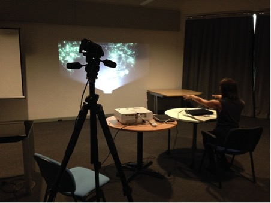
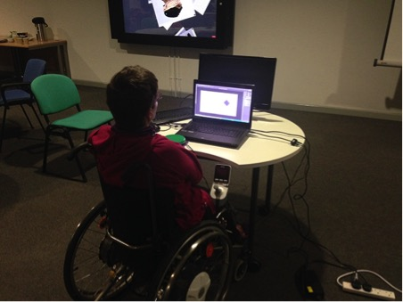

# D2ART: TRANSFORMING DISABILITY ARTS THROUGH DIGITAL TECHNOLOGIES

_An artist experimenting with mid-air gesturing technology_

Professional disabled visual artists can experience significant barriers when producing their work – in particular, physically impaired artists can find it difficult (or impossible) to use traditional artistic tools such as brushes, pencils, or large canvases. Novel and innovative digital technologies such as eye gaze tracking, mid-air gesturing, speech recognition, and motion tracking hold huge potential to support and transform the creative practice of physically impaired visual artists. These technologies have also dropped significantly in price over the past couple of years, but little work has explored the extent to which they are currently being utilised by disabled artists.

The D2ART project addressed this lack of work through exploring the current practice of disabled artists and evaluating the potential of digital technologies. A national online survey was disseminated across the disability arts field (examining existing practice and use of digital technologies for creative work) and responses were received from artists aged between 20-74 at a variety of career stages (emerging, mid-career, and established). The artists reported a range of physical conditions that influence their practice such as multiple sclerosis, motor neurone disease, generalised dystonia, muscular dystrophy, cerebral palsy, arthrogryposis, quadriplegia, and multiple joint arthritis. Twelve of the artists who completed the survey were invited to the University of Birmingham to explore details of their practice in further detail – as well as an opportunity to use and evaluate a range of innovative technologies. The final part of the project involved providing four disabled artists with laptops and eye gaze tracking devices for them to evaluate the use of this technology in their own working environment over a number of weeks.

A key initial assumption we had around this work was that physically impaired artists would likely be familiar with many of the innovative tools available, but this was clearly not the case. Analysis of the data collected identified that the majority of artists were not using digital assistive technologies within their practice and that there was a lack of awareness around the availability of affordable novel technologies. It was therefore very rewarding in the evaluation sessions to see the artists’ excitement in having the chance to try out these technologies and in hearing their thoughts around how they could support practice, present new creative opportunities, and address some of the barriers they currently experience.

In terms of social impact, the project widely disseminated the availability and potential of new digital technologies to support creative practice across the disability arts sector. This was possible through the multi-disciplinary team involved on the project which included DASH (Disability Arts Shropshire), Arts Council England, University of Illinois at Chicago (specialising in disability studies), the School of Art at Birmingham City University, Beaumont College (a special needs college run by the charity Scope), and National Star College. These partners were all able to share and disseminate the outcomes of the projects with different audiences at related events and through online platforms (websites, social media, newsletters, etc.).

_Artist Tanya Raabe evaluating the use of head tracking technology to control Photoshop_

The project also led to a collaboration and partnership around an Arts Council England grant application “Portraits Untold” (portraitsuntold.co.uk) with the established disabled artist Tanya Raabe (tanyaraabe.co.uk). This project involved Tanya investigating the use of digital technologies in her artistic practice when doing live portraits of high profile sitters at prestigious locations (e.g. Dame Evelyn Glennie at the National Portrait Gallery). We also worked with Sarah Ezekiel during the project (sarahezekiel.com); Sarah has motor neurone disease and uses eye gaze tracking technology to produce her artistic work which she exhibits and sells internationally online. Sarah’s work demonstrates the potential of innovative digital technologies to support creative practice, although the D2ART project did identify several key usability and interaction issues when using such technologies with existing creative software. For instance, it was found that using eye gaze tracking with Photoshop was a particularly frustrating and tedious experience, primarily as the interface has been designed for mouse and keyboard input.

The D2ART project was successful in better understanding the current practice of disabled visual artists, identifying the potential of novel digital technologies to support creative work, and in widely disseminating the range of affordable digital tools and technologies commercially available. However, the project also identified that further work is clearly needed to develop solutions that are better optimised and tailored for disabled artists who want to utilise these types of technologies in their practice.

Chris Creed

School of Computing and Digital Technology
Birmingham City University

**Links and Resources:**
Creed, C., 2016. ‘Assistive tools for disability arts: collaborative experiences in working with disabled artists and stakeholders’ in the _Journal of Assistive Technologies_, 10(2), pp.121-129.

