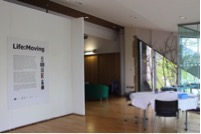
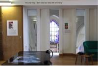
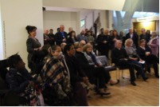

# DIGITAL TECHNOLOGY AND HUMAN VULNERABILITY: TOWARDS AN ETHICAL FILM PRAXIS

In the last two decades, digital developments have afforded new possibilities for the recording, representation and sharing of the profoundly private and rarely seen experience of dying, as well as that of human vulnerability more broadly. This considerable surge in visual content, and in our exposure to others’ suffering, has been accompanied by only limited discussion of its ethical implications.

Centred on a six-month filmmaking project based at John Taylor Hospice in Birmingham, this research investigated the ethical issues involved in representing end of life experience through the medium of digital film. Through workshops and home visits, participants were given practical and critical training and support to develop and co-create their own films. Working closely with key members of the interdisciplinary team, different ideas, priorities and devices were explored and six films created. An exhibition was designed for these films and installed at a community space local to the hospice at the end of the project. 

The project aimed to challenge society’s misconceptions about terminal illness by providing those experiencing it with the opportunity, skills and platforms to tell their own stories, and by bringing these stories to a wide audience. In prioritising ethical praxis – as the project’s foundations and orientation and ongoing discussion point -  in the workshops, research meetings and exhibition, the project aimed to counter the pervasive objectification, dehumanisation, exploitation or disregard of the dying within visual culture. In these ways, the research seeks to better understand the potential of digital film to serve the best interests of the vulnerable lives it so often depicts and then disseminates.

  

Fundamental to the project, and its ethical emphases, was the authorship and ownership of the films by the participants themselves. Rather than meaning being imposed upon them by a filmmaker, however well-intentioned, the individuals making these films were to tell their own truth. Inevitably, how this happened, and the filmmaker or PI’s degree of involvement in the final films, varied considerably. One participant, Yussef, died soon after the project began, and the final film, a collaboration between Haifa, his wife, and Briony, the filmmaker, pieced together photographs and footage from family and friends. Losing Yussef so early on, the team was reluctant to fix his story without him. Therefore, in addition to presenting the edited film on the central projector at the end of project exhibition, other clips and recordings, which were produced or selected by Yussef and Haifa as part of the project, were available on a touchtable. 

Hospitalisations, ill health, medical treatments but also the personal impact of turning the camera on oneself, disrupted participants’ progress and delayed the project’s completion. Participants were extremely keen to realise their objectives – and the project revealed itself to be very important to them and in a range of ways – but the project had to adapt as a result. As well as affecting the timetable, these practical and, invariably, emotionally-loaded issues became a principal concern for the team who focused, increasingly, on maximising benefit for the participants. Originally framed as therapeutic effect and among a range of other benefits and beneficiaries, the personal, interpersonal and familial impact of the project gained in prominence as the project evolved. So too did the sense of the power of the films and the process for other stakeholders, not only the participants’ families/friends and the public, but for end of life care professionals. Indeed, the latter, whether working within the care system or independent of it, have proven especially eager to collaborate on the research’s dissemination. This has formed part of their or their umbrella organisations’ own response to digital film’s offer and concern with ethics, but has also arisen because the films provide rare insight into patients’ experiences and the value of arts practice that has potential to inform staff training as well hospice policy. 

The films and/or exhibition continues to be shared around the country, most recently at Hospice UK’s national conference, and will be installed as part of a participatory arts festival in Cyprus in December. Further national and international exhibitions are anticipated.

Michele Aaron

**Links and Resources:**

Project website: https://lifemoving.org/
John Taylor Website: https://www.johntaylorhospice.org.uk/

**The Research team:**

Dr Michele Aaron, Principal Investigator, Film Studies, University of Birmingham, but now at University of Warwick; Professor Russell Beale, Co-I, Computer Science, University of Birmingham; Briony Campbell, Co-I, Professional Filmmaker; Jed Jerwood, Art Psychotherapist, John Taylor Hospice; Dr Cath Lambert, Co-I, Sociology, University of Warwick; Dr Lisa Metherell, Co-I, School of Art, Birmingham City University; Dr Adrian Banting, Research Fellow.

Photographs of 'Life:Moving', the end of project exhibition, courtesy of Briony Campbell.
