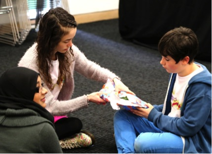
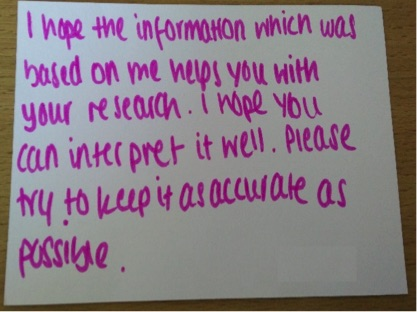

# CURATING CHILDHOODS – ‘DATA ARE PEOPLE’

_Children taking part in the archive workshop_	

The aim of the Curating Childhoods project was to re-imagine the relationship between children and archives in a digital age. Working in collaboration with the Mass Observation Archive, the project set out to establish a new ‘Everyday Childhoods’ collection of multimedia material that children and young people could directly contribute to and which would act an important site of discussion between children, archivists and researchers about the ethical ramifications of making data public. 

The project took place against a backdrop of mounting ethical debate around children’s data in an age of pervasive digital media. In these debates – both in the mainstream media and in academic research – adult concerns to ‘protect’ the privacy of children and their data have often been found to be at odds with a digital culture that invites children and young people to ‘participate’ in the public curation and sharing of data. Responding to these debates, our project proposed to explore ‘the archive’ as a space of creative collaboration and dialogue where children, their families, researchers and archivists could discuss the ethical challenges of sharing data publically. In particular, the project aimed to forge new dialogues between the ‘private’ curation practices of children and the ‘public’ curation practices of archives.  

A one-day workshop was held at the Mass Observation Archive for children and families who had contributed to a preceding study and whose data was being deposited in the ‘Everyday Childhoods’ collection. Joined by researchers and archivists, the children and families were invited to discuss how their data would be archived and to explore the ethical implications of making the data public. Through a series of games and discussion activities, the workshop explored a range of issues relating to the long term care of the data in the archive, including: consent and data re-use, anonymisation and privacy, and future re-interpretation and publication.    

One activity providing rich insights entailed the writing of postcards to ‘future users’ of the archive (Image 2). These postcards provided an opportunity for participants to express their hopes and concerns for how their data might be used and interpreted by others. These postcards revealed a diverse range of concerns, with children particularly requesting respectful interpretation of their data and hopes that they wouldn’t be ‘misrepresented’. One young person elaborated that future archives should remember, “data are people too!” In contrast, the postcards of adults – including parents and researchers – focused on impressing the duty of care for the data and responsibility for its public circulation. These postcards are now held in the Everyday Childhoods collection as ‘messages’ for future users of the archive. 

_A child’s postcard to a ‘future’ archive user_

Through the workshop and a series of public engagement activities our project demonstrated that dialogues between children and archives can be of great value for both parties. For archivists and researchers these discussions invite new understanding of the contemporary digital data environment that current generations are growing up in, and the types of ethical concerns that this digital environment foregrounds around privacy, respect and reputation. For children and young people, the archive represents an alternate space for imagining how data might be made public in a way that is guided by ethical concerns of care, confidentiality and consent. In an environment where the boundaries between public and private are increasingly being turned ‘inside out’, the public archive stands out as a space where potentially sensitive and collaborative approaches to making data public can be explored and made possible.   
                  

Rachel Thomson

**Links and Resources:**      
The project website for Curating Childhoods: http://blogs.sussex.ac.uk/everydaychildhoods 

As part of the workshop a series of videos were created with children, parents, researchers and archivists responding to questions about the ethics of sharing data. These videos can be viewed here: https://www.youtube.com/playlist?list=PLzvJrGDqP_21hEoYvG0eiTLF-Zzg8baot 

A book about the project is due to be published by Bloomsbury in 2017: Researching Everyday Childhoods in a Digital Age: Time, Technology & Documentation (eds. Thomson, Berriman & Bragg). 

**The research team:**
Prof Rachel Thomson and Dr Liam Berriman, University of Sussex; Fiona Courage, The Mass Observation Archive.
