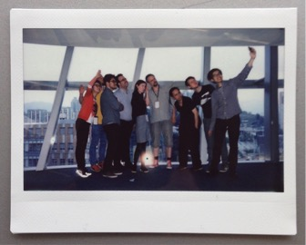
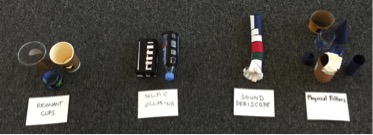
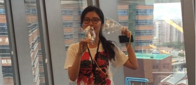
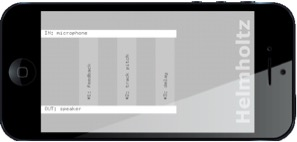

# SOCIAL MUSIC: PET SOUNDS

_Image 1: The ISEA workshop participants gather for a group selfie._

The Pet Sounds project explored the possibilities of music making in the age of social media. Collaborative or ‘social’ modes of music composition are largely absent from social media cultures. On Facebook, for example, music is frequently shared but it is rarely created or composed. With Pet Sounds we sought to enable new modes of social composition whereby anyone might create music through everyday online social interactions. We further imagined that this music could reflect the various genres born of social media, i.e. the selfie, the tweet, the emoticon. Our research was therefore propelled by questions such as, ‘what might a musical selfie sound like?’ and ‘how might an audio emoticon extend the language of online conversations’? Our cross-disciplinary study, which spanned creative practice in music, the development of new technologies, and humanities-based research in musicology and anthropology, aimed to explore how everyday social music-making or ‘ubiquitous composing’ might yield new insights into musical communication, digital social life, and their mutual mediation.

Over the course of the year we hosted six workshops that explored various themes related to social music-making and that implemented speculative designs or ‘design fictions’. We therefore adopted methodologies and materials that are unusual in the context of music technology. Whereas one might normally prototype in pseudocode, we used everyday objects (bits of paper, scissors, tape, etc.) in order to quickly sketch out designs that we would only later implement in code. Rather than taking a tutorial or user-study approach, whereby a prototyped device is road-tested on an audience, our workshop members were active participants in the process of conceptualisation and design. 

_Image 2: Four musical selfie device prototypes (left to right): Resonant cups. Slide Ocarina. Sound Periscope. Physical Filters._

One workshop, which explored the theme of ‘musical selfies’, took place in Hong Kong, at the annual meeting of the International Society for Electronic Arts (ISEA) (Image 1). We conceived this workshop as an experiment in speculative design, in which the outcome was to prototype a putative musical selfie app/device using everyday objects. The organisation of the day was kept deliberately loose in order to achieve this objective through dialogue, collaboration and making – all guided around the question ‘what is a musical selfie?’ Moving from abstract to concrete, we began with a structured discussion, and moved on to collaboratively write a ‘musical selfie manifesto’ where we defined the concept more rigidly. The workshop participants then designed prototype musical selfie devices that drew out different themes of the discussion, using everyday objects (Image 2).

Two workshop participants created ‘Ear-Spy’, a game-based device for generating text-sound performances. Another participant developed ‘The Musical Selfie Stick’ (Image 3), a device that allows an operator to channel their voice along a long thin tube, not unlike a periscope or didgeridoo. This allowed the operator to place their voice at a distance and hear their voice from a different spatial position, thus mimicking the selfie stick. A further participant displayed a device that used the string-between-two-tin-cans principle to pass one’s own voice back to oneself and allow for enhanced ‘self-reflection’ (Image 4). 

_Image 3: ‘Musical Selfie Stick’. Sound periscope concept being demonstrated as an audio equivalent to the ubiquitous selfie stick._

_Image 4: Playing your own voice back to yourself with a tin can style string arrangement makes it clear to onlookers that you are being ‘self-reflective’._

The musical selfie workshop was a stimulating, enjoyable and convivial experiment in speculative design that moved easily between conceptual and practical invention and produced a number of genuinely novel individual and collaborative results. The joint expertise of those present meant we were able to essentially delegate our speculative idea – the ‘musical selfie’ – to the group for us to work out collectively. Building on ideas discussed in the ISEA workshop, we re-imagined the selfie as a kind of feedback loop: a portrait of a user in an environment against which he or she continually adjusts their face, pose, posture and framing until a satisfying image is produced. This formed the basis of our ‘Helmholtz’ app (Image 5). 

_Image5: Helmholtz app. Each button when pressed routes the input (mic) to the output (speaker) in a different manner allowing feedback effects to be explored and mixed together (unaffected, pitch tracking and delay)._

Our workshops therefore demonstrated the value of speculative design in the creation of new musical interfaces. Overall, the project revealed the vast potential for new kinds of music making in today’s socially networked world.

Gascia Ouzounian

**Links and Resources:**
https://www.echo-snap.com/

**Research team:**
Gascia Ouzounian (University of Oxford); Peter Bennett (University of Bristol); Christopher Haworth (University of Birmingham); Georgina Born (University of Oxford).

